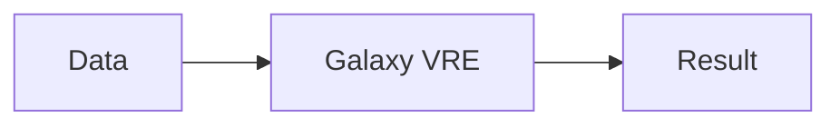

# 🏗️ AquaINFRA Handbook Architecture

This document describes the technical blueprint and system design of the AquaINFRA Training Handbooks.

## 🛠️ Technology Stack
- **Framework**: [Jekyll](https://jekyllrb.com/) (Static Site Generator).
- **Styling**: Vanilla CSS with a modularized Design System (`sidebar.css`, `theme.css`, `style.css`).
- **Templating**: Liquid (Jekyll default).
- **Hosting**: GitHub Pages.

## 📁 Directory Structure
```
├── docs/                   # Jekyll source directory (DEPLOY FROM HERE)
│   ├── _data/              # Data files (use_cases.yml)
│   ├── _includes/          # Reusable components (sidebar, header)
│   ├── _layouts/           # Page templates (default.html)
│   ├── assets/             # Global CSS, Images, and JS
│   ├── trainings/          # Use Case folders
│   ├── index.md            # Home page (High-level entry)
│   ├── _config.yml         # Site configuration (Zero-Config)
│   └── ...                 # Content pages (01_eosc.md, etc.)
├── ARCHITECTURE.md         # This file
├── CONTRIBUTING.md         # Contributor guide
└── README.md               # Project overview
```

## 🛤️ The Guided Sequence Logic
The site is structured to enforce a logical learning flow. Each of the main step pages uses the `btn-seq` class for navigation:
- **Consistent UI**: Every page must have a `sequence-navigation` container at the bottom.
- **Path Steps**: The homepage (`index.md`) defines the sequence while the sub-pages provide the content.

## 🎨 Modular Design System
We use decoupled CSS for maximum control and performance:
- **`sidebar.css`**: Controls the navigation bar sizes, Title Case headers, and compact layout rules.
- **`theme.css`**: Contains premium UI elements (Hero, Step Cards, Callouts, Wave decorations).
- **`style.css`**: Global base styles for typography, layout grid, and fundamental resets.
- **Primary Color**: `#3564AC` (AquaINFRA Blue).

## 🗂️ Data-Driven Sidebar
The sidebar is dynamically generated from `docs/_data/use_cases.yml`. To add a new training to the library, it must be registered in this YAML file under the appropriate region.

## 🗺️ Universal Pathing (Zero-Config)
To ensure the handbook is 100% portable across any GitHub account or repository name, we use **Universal Pathing** logic in `_layouts/default.html`.
- **Dynamic Roots**: The site automatically calculates the depth of the current page (e.g., `../` or `../../`) and prepends it to all assets and links.
- **Config-Free**: This removes the need for hardcoding `baseurl` or `url` in `_config.yml`.

## 🧜 Workflow Support
The site includes `Mermaid.js` support. You can add diagrams directly in Markdown:

