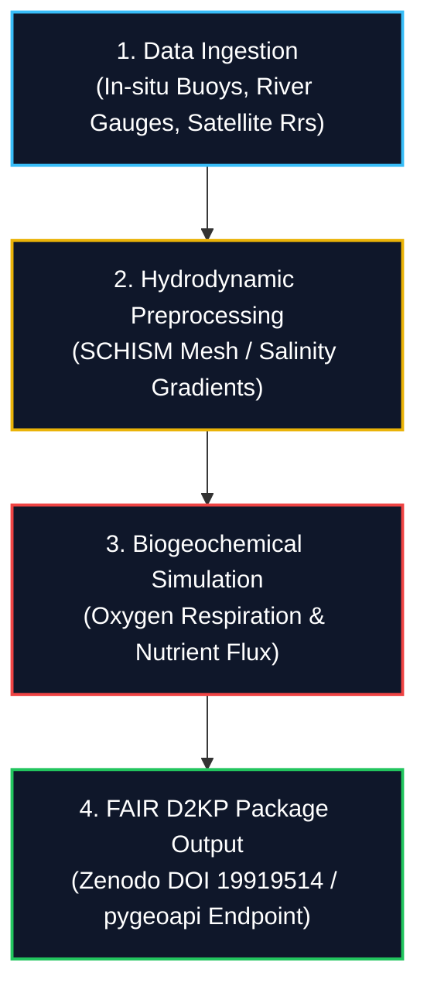

# Analytical Workflow & D2KP Execution

Chapter 3 of 3

    
This chapter presents the end-to-end analytical workflow for the Elbe Estuary use case. It details how river discharge, salinity, and water quality datasets are ingested, processed through hydrodynamic transport models, and published as a FAIR Data-to-Knowledge Package (D2KP).

---

## 4-Stage Processing Pipeline

---

    
Check Your Understanding: FAIR D2KP Reproducibility

    

        
<strong>Question:</strong> How does publishing the Elbe Estuary workflow as a Data-to-Knowledge Package (D2KP) ensure reproducible science?

        
<strong>Answer:</strong> A D2KP bundles all foundational elements into a single citable package on Zenodo (DOI: 10.5281/zenodo.19919514): raw input datasets, Galaxy workflow pipelines (<code>.ga</code> files), executable R/Python source scripts, container environment definitions (Conda/Binder), and automated OGC Web API endpoints (<code>pygeoapi</code>). Any researcher can re-run or inspect the exact pipeline without software configuration hurdles.

    

---
