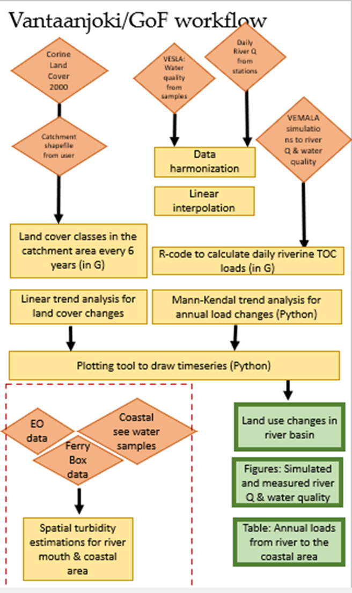
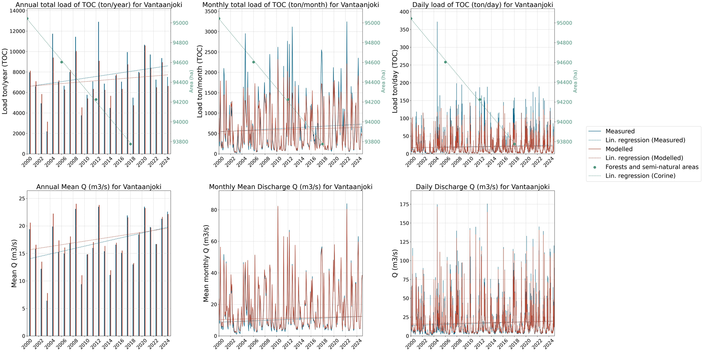
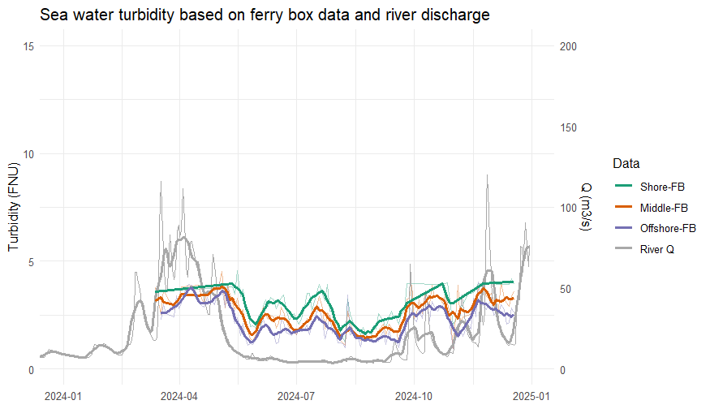
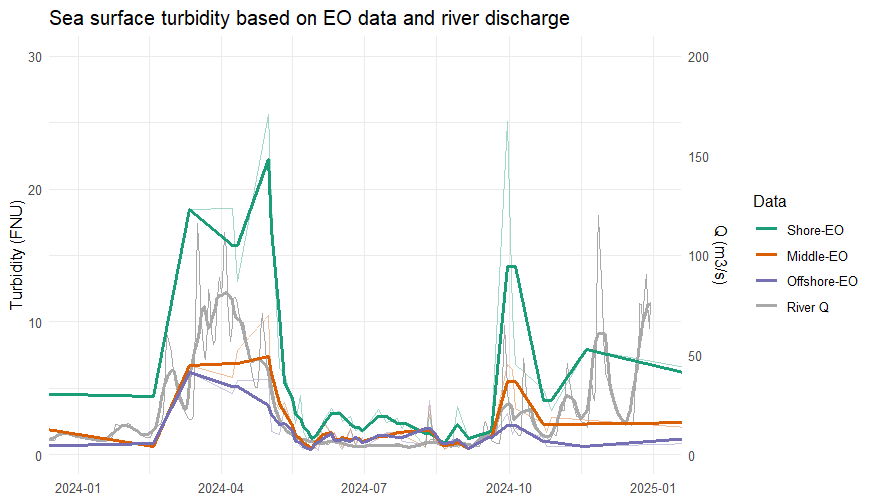

# Workflow

Chapter 3 of 3

    
Details about the data pipelines, modelling, and computational workflows implemented.

The workflow connects the land–river–coast continuum to explore potential long-term relationships between land use change and river water quality. It is designed to be executed within the Galaxy platform.

### Workflow Inputs

    <table>
        <thead>
            <tr>
                <th>Data Source</th>
                <th>Variables</th>
            </tr>
        </thead>
        <tbody>
            <tr>
                <td><strong>River Water Quality</strong></td>
                <td>Time-series of concentrations (sensor data and water chemistry samples).</td>
            </tr>
            <tr>
                <td><strong>Hydrology</strong></td>
                <td>River discharge measurements.</td>
            </tr>
            <tr>
                <td><strong>Land Use</strong></td>
                <td>CORINE land-use datasets (2000-2018) for the Vantaanjoki basin.</td>
            </tr>
            <tr>
                <td><strong>Marine Observation</strong></td>
                <td>Earth Observation (EO) data from the Gulf of Finland.</td>
            </tr>
            <tr>
                <td><strong>FerryBox</strong></td>
                <td>Transect data from the Gulf of Finland, including chlorophyll a, turbidity, and CDOM.</td>
            </tr>
        </tbody>
    </table>

### Processing Stages

The processing stage consists of three interconnected components after datasets are discovered, filtered, and harmonized:

1. **Calculate Riverine Loads:** Computes loads by combining concentrations with discharge, aggregating them to monthly/annual values. Trend analysis is performed.
2. **Quantify Land-use Change:** Analyses the basin and its sub-catchments over the study period, preparing metrics to explain river load variability.
3. **Analyse Coastal Gradients:** Maps coast-to-offshore gradients along FerryBox lines, comparing optical water variables (turbidity) directly to river export signals.

The workflow exports all results for reporting and policy assessment while preserving full data provenance.

<figure style="text-align: center; margin: 2rem 0;">
  
  <figcaption style="font-size: 0.85rem; color: var(--text-muted); margin-top: 0.5rem;">Figure 1: Overall flowchart of the Vantaanjoki River and Gulf of Finland workflow.</figcaption>
</figure>

### Workflow Results

The output of this workflow produces comprehensive time-series and correlation data linking inland activities to marine impacts.

    <figure style="text-align: center; margin: 0;">
      
      <figcaption style="font-size: 0.85rem; color: var(--text-muted); margin-top: 0.5rem;">Figure 2: Visual timeseries and regression analysis linking riverine loads and land-use (CORINE) data.</figcaption>
    </figure>

    <figure style="text-align: center; margin: 0;">
      
      <figcaption style="font-size: 0.85rem; color: var(--text-muted); margin-top: 0.5rem;">Figure 3: Map showing the center points of marine FerryBox aggregation areas and automated river stations.</figcaption>
    </figure>

    <figure style="text-align: center; margin: 0;">
      
      <figcaption style="font-size: 0.85rem; color: var(--text-muted); margin-top: 0.5rem;">Figure 4: River discharge and satellite (EO) turbidity estimates as a function of time from the same locations.</figcaption>
    </figure>

---
