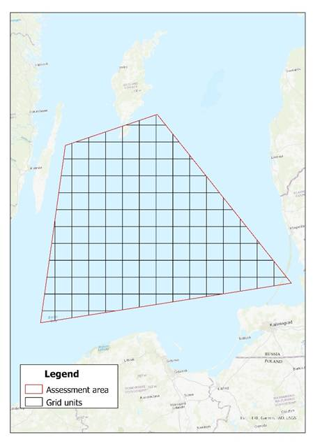
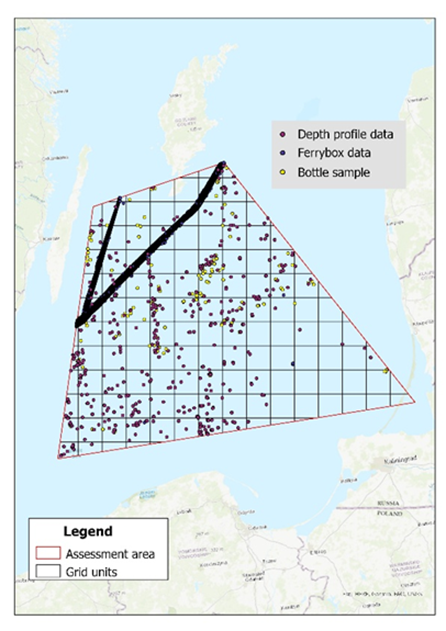

# The Research Story — Darkening of the Gulf of Riga

Chapter 2 of 7

    
The case study begins with divers noticing the Gulf of Riga growing darker. To answer if optical properties change over the long term, a reproducible workflow was developed using <a href="../../reference/glossary#secchi-depth" target="_blank" rel="noopener">Secchi-depth</a> measurements (water transparency). The analysis is highly influenced by seasonal changes and river runoffs in this unique semi-enclosed environment.

    <iframe src="https://www.youtube.com/embed/2M6ZhpqQz2g" frameborder="0" allow="accelerometer; autoplay; clipboard-write; encrypted-media; gyroscope; picture-in-picture; web-share" referrerpolicy="strict-origin-when-cross-origin" allowfullscreen></iframe>

    <figure style="text-align: center; margin: 0;">
      

        
        
      

      <figcaption style="font-size: 0.85rem; color: var(--text-muted); margin-top: 1rem;">Figure 1: Visualisation of the generated assessment area and assessment grid (left) alongside the various types of sample data used in the Gulf of Riga analysis (right).</figcaption>
    </figure>

    <strong>RESEARCH QUESTION</strong>
    
Do the optical properties in the Gulf of Riga change over the long term?

---
