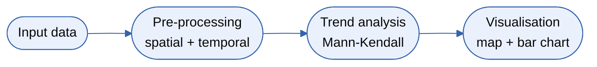
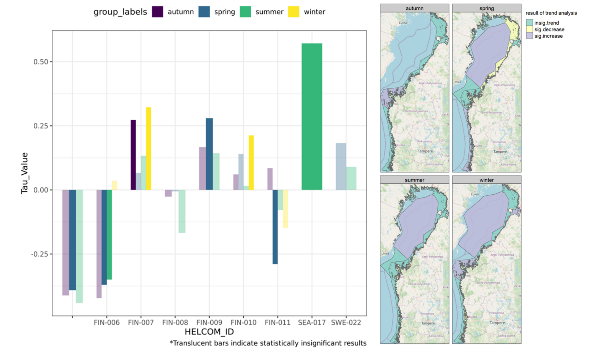
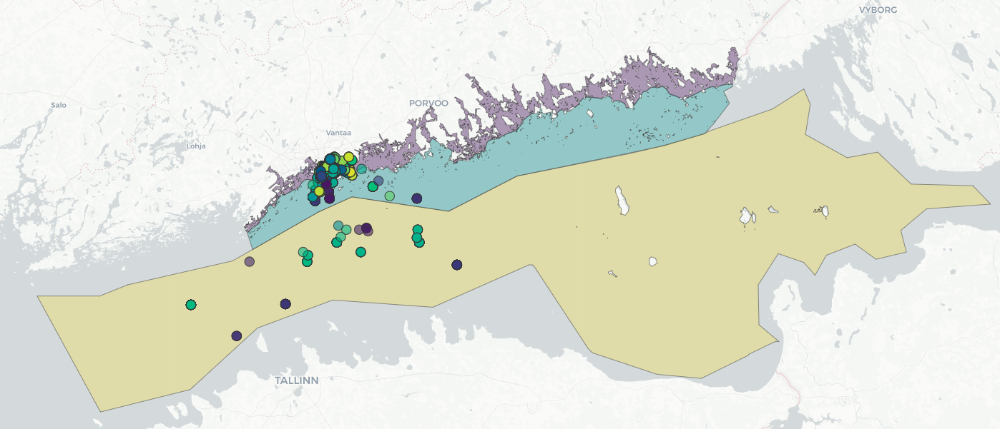

# Running the Daugava Workflow

Chapter 6 of 7

    
With data imported, the workflow begins executing its tools. The process involves spatial aggregation (assigning points to polygons), temporal aggregation (assigning seasons), calculating mean values, filtering out regions with insufficient data, and finally running the nonparametric <a href="../../reference/glossary#mann-kendall" target="_blank" rel="noopener">Mann-Kendall</a> trend analysis to detect significant trends.

    <iframe src="https://www.youtube.com/embed/1G9DKzqceog" frameborder="0" allow="accelerometer; autoplay; clipboard-write; encrypted-media; gyroscope; picture-in-picture; web-share" referrerpolicy="strict-origin-when-cross-origin" allowfullscreen></iframe>

## Workflow structure

    <figure style="text-align: center; margin: 0;">
      
      <figcaption style="font-size: 0.85rem; color: var(--text-muted); margin-top: 1rem;">Figure 2: The Gulf of Riga DGA workflow involving data pre-processing, Mann-Kendall trend analysis, and visualisation.</figcaption>
    </figure>

### Workflow Transferability

The reusability of this workflow has been demonstrated by successfully applying it to other regions, such as the Bothnian Bay and the Gulf of Finland.

    <figure style="text-align: center; margin: 0;">
      

        
        
      

      <figcaption style="font-size: 0.85rem; color: var(--text-muted); margin-top: 1rem;">Figure 3: Demonstration of workflow transferability. Left: Upscaling to the Bothnian Bay showing seasonal Mann-Kendall trend results for Secchi depth across HELCOM subbasins. Right: Transferability to the Gulf of Finland showing input monitoring stations and HELCOM spatial regions.</figcaption>
    </figure>

---
