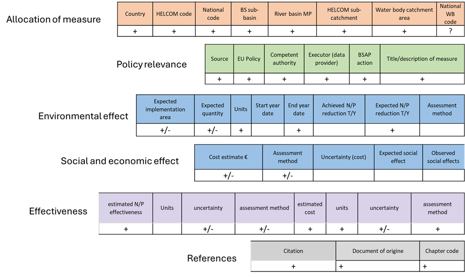

# Analyzing Results & Conclusions

Chapter 7 of 7

    
Reviewing the final output reveals statistically significant decreasing transparency trends in three coastal assessment units, answering the primary research question. The chapter concludes by outlining future research directions to understand the driving forces behind this darkening.

    <iframe src="https://www.youtube.com/embed/spm7vSlspQ8" title="YouTube video player" frameborder="0" allow="accelerometer; autoplay; clipboard-write; encrypted-media; gyroscope; picture-in-picture; web-share" referrerpolicy="strict-origin-when-cross-origin" allowfullscreen></iframe>

    <strong>ANSWER</strong>
    
Darkening confirmed - water transparency is significantly decreasing in three Latvian coastal units (summer at LAT-003 and LAT-004, autumn at LAT-005). LAT-005 covers the Daugava catchment near Riga, pointing at a land or runoff driver.

### Daugava River Nutrient Assessment

To identify the potential effect of measures planned in the Latvian part of the Daugava catchment, an assessment was conducted on the availability of data required to estimate potential environmental, social, and economic effects. 

    <figure style="text-align: center; margin: 0;">
      
      <figcaption style="font-size: 0.85rem; color: var(--text-muted); margin-top: 0.5rem;">Figure 4: Availability of data required for the assessment of effectiveness of measures to reduce nutrient input to the Baltic Sea and their sufficiency to achieve BSAP goals in the RBMP for the Latvian part of the Daugava River.</figcaption>
    </figure>

## What's next

The workflow answered *what* is happening; the open questions are about *why*:

- Which optical components (CDOM, suspended sediment, chlorophyll) drive the change?
- Are riverine loads changing in the rivers discharging into the gulf?
- Which pressures - land use, climate change - and which socioeconomic drivers sit behind them?

Cite the analysis via the <a href="https://aquainfra.dev.52north.org/result/zenodo:17175368" target="_blank" rel="noopener">D2KP DOI on Zenodo</a>.

---
