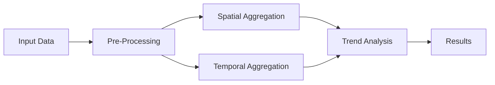

# The Gulf of Riga DGA Workflow

This chapter details the specific "Data Gathering and Analysis" (DGA) workflow used in the case study. The workflow integrates **eight distinct tools** into a pipeline.

## 1. Input Data
The workflow starts with two datasets:

1.  **Point Data**: In-situ measurements of Secchi depth (water transparency).
2.  **Polygon Data**: Assessment unit polygons defining the spatial boundaries of the regions being studied.

## 2. Pre-Processing

### Spatial Aggregation
*   **Goal**: Assign scattered data points to specific administrative or geographical units.
*   **Process**: Points are mapped to "Assessment Unit" polygons. A new attribute is added to each data point indicating which unit it falls into.

### Temporal Aggregation
*   **Goal**: Account for seasonality (crucial in the Gulf of Riga).
*   **Process**: Based on the visit date, each point is assigned a **Season** (e.g., Spring, Summer).

## 3. Data Analysis Steps

### Calculate Mean Values (Group 1)
Calculates the average transparency for granular groups defined by:
*   Season
*   Year
*   Assessment Unit ID
*   Location

### Calculate Mean Values (Group 2)
Further aggregates the data to get a single value per unit-year-season.
*   **Output**: A structured CSV file where each record represents a transparency value for a specific unit, year, and season.

### Time Series Interpolation
To prepare for trend analysis, the data must be continuous.

{: .important }
> **Exclusion Criteria**:
> *   Units with **< 10 data points** are excluded.
> *   Units where **> 80% of data is missing** (compared to the time series length) are excluded.

*   **Interpolation**: For the remaining units, missing values are statistically interpolated to fill gaps.

### Mann-Kendall Trend Analysis
The final analytical step.
*   **Method**: A **Mann-Kendall test** (non-parametric statistical test) is applied.
*   **Purpose**: To detect if there is a monotonic upward or downward trend in the Secchi depth variable over time.

## 4. Visualization
The workflow automatically generates:
1.  **Interactive Map**: Showing the assessment units.
2.  **Bar Chart**: Displaying **Kendall's Tau** values. A negative Tau indicates a decreasing trend (darkening), while positive indicates clearing.

---

    <strong>📹 Video Reference</strong>
    <a href="https://www.youtube.com/watch?v=lfGLnLyqaIs&t=1289s" target="_blank">21:29</a> Detailed Review of the Workflow Components

    <a href="{{ relative_root }}trainings/gulf-of-riga/07_hands_on_tutorial" class="btn-seq btn-seq--prev">← Previous: Hands-On Tutorial</a>
    <a href="{{ relative_root }}trainings/gulf-of-riga/09_results" class="btn-seq btn-seq--next">Next Chapter: Results →</a>

