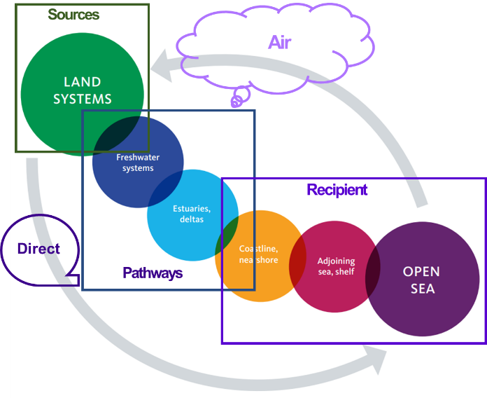
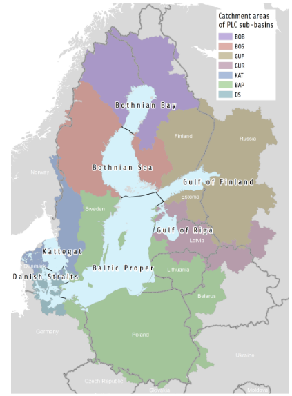

# Introduction

Chapter 1 of 3

    
Exploring how AquaINFRA supports HELCOM's "Source-to-Sea" approach by integrating DAPSIM components for the Baltic Sea.

The Helsinki Commission (HELCOM) is an intergovernmental organization dedicated to protecting the marine environment of the Baltic Sea from all sources of pollution. A core challenge for HELCOM is assessing the effectiveness of measures aimed at reducing nutrient enrichment and eutrophication.

    <figure style="flex: 1; min-width: 300px; text-align: center; margin: 0;">
      
      <figcaption style="font-size: 0.85rem; color: var(--text-muted); margin-top: 0.5rem;">Figure 1a: Source-to-sea system for pollution data management.</figcaption>
    </figure>
    <figure style="flex: 1; min-width: 300px; text-align: center; margin: 0;">
      
      <figcaption style="font-size: 0.85rem; color: var(--text-muted); margin-top: 0.5rem;">Figure 1b: Map of Baltic Sea catchment colour coded to HELCOM PLC sub-basins.</figcaption>
    </figure>

To achieve this, the AquaINFRA project applies the **DAPSIM** framework (Drivers, Activities, Pressures, States, Impacts, Measures), connecting societal drivers to marine impacts and evaluating the success of implemented policies.

<figure class="diagram diagram--svg diagram--svg--w620">

<svg viewBox="0 0 620 640" role="img" aria-labelledby="hel-title hel-desc">
  <title id="hel-title">The DAPSIM cycle applied to the Baltic Sea</title>
  <desc id="hel-desc">Six linked stages run clockwise around the HELCOM Baltic Sea core: Drivers (societal demand), Activities (human uses), Pressures (loads and disturbance), States (ecosystem condition), Impacts (ecosystem services), and Measures (policy response), which feed back into the drivers.</desc>

  <defs>
    <marker id="helArrow" viewBox="0 0 10 10" refX="5" refY="5" markerWidth="6" markerHeight="6" orient="auto-start-reverse">
      <path d="M 0 0 L 10 5 L 0 10 z" fill="#64748b"/>
    </marker>
    <linearGradient id="helD" x1="0" y1="0" x2="1" y2="1"><stop offset="0%" stop-color="#e11d48"/><stop offset="100%" stop-color="#9f1239"/></linearGradient>
    <linearGradient id="helA" x1="0" y1="0" x2="1" y2="1"><stop offset="0%" stop-color="#ea580c"/><stop offset="100%" stop-color="#9a3412"/></linearGradient>
    <linearGradient id="helP" x1="0" y1="0" x2="1" y2="1"><stop offset="0%" stop-color="#ca8a04"/><stop offset="100%" stop-color="#854d0e"/></linearGradient>
    <linearGradient id="helS" x1="0" y1="0" x2="1" y2="1"><stop offset="0%" stop-color="#16a34a"/><stop offset="100%" stop-color="#166534"/></linearGradient>
    <linearGradient id="helI" x1="0" y1="0" x2="1" y2="1"><stop offset="0%" stop-color="#2563eb"/><stop offset="100%" stop-color="#1e40af"/></linearGradient>
    <linearGradient id="helM" x1="0" y1="0" x2="1" y2="1"><stop offset="0%" stop-color="#7c3aed"/><stop offset="100%" stop-color="#5b21b6"/></linearGradient>
  </defs>

  <text x="310" y="36" class="fig-title" text-anchor="middle">The DAPSIM cycle in the Baltic Sea</text>

  <g transform="translate(310, 340)">
    <!-- Segments -->
    <path d="M 0 -95 L 0 -220 A 220 220 0 0 1 190.5 -110 L 82.2 -47.5 A 95 95 0 0 0 0 -95 Z" fill="url(#helD)" stroke="#0f172a" stroke-width="3"/>
    <path d="M 190.5 -110 A 220 220 0 0 1 190.5 110 L 82.2 47.5 A 95 95 0 0 0 82.2 -47.5 Z" fill="url(#helA)" stroke="#0f172a" stroke-width="3"/>
    <path d="M 190.5 110 A 220 220 0 0 1 0 220 L 0 95 A 95 95 0 0 0 82.2 47.5 Z" fill="url(#helP)" stroke="#0f172a" stroke-width="3"/>
    <path d="M 0 220 A 220 220 0 0 1 -190.5 110 L -82.2 47.5 A 95 95 0 0 0 0 95 Z" fill="url(#helS)" stroke="#0f172a" stroke-width="3"/>
    <path d="M -190.5 110 A 220 220 0 0 1 -190.5 -110 L -82.2 -47.5 A 95 95 0 0 0 -82.2 47.5 Z" fill="url(#helI)" stroke="#0f172a" stroke-width="3"/>
    <path d="M -190.5 -110 A 220 220 0 0 1 0 -220 L 0 -95 A 95 95 0 0 0 -82.2 -47.5 Z" fill="url(#helM)" stroke="#0f172a" stroke-width="3"/>

    <!-- Core -->
    <circle cx="0" cy="0" r="80" fill="#1e293b" stroke="#334155" stroke-width="4"/>
    <text x="0" y="-6" class="fig-title" text-anchor="middle">HELCOM</text>
    <text x="0" y="18" class="fig-sub" text-anchor="middle">Baltic Sea</text>

    <!-- Segment labels, horizontal for legibility -->
    <text x="79" y="-141" class="fig-label" text-anchor="middle">Drivers</text>
    <text x="79" y="-121" class="fig-sub" text-anchor="middle">societal demand</text>

    <text x="157" y="-6" class="fig-label" text-anchor="middle">Activities</text>
    <text x="157" y="14" class="fig-sub" text-anchor="middle">human uses</text>

    <text x="79" y="129" class="fig-label" text-anchor="middle">Pressures</text>
    <text x="79" y="149" class="fig-sub" text-anchor="middle">loads &amp; disturbance</text>

    <text x="-79" y="129" class="fig-label" text-anchor="middle">States</text>
    <text x="-79" y="149" class="fig-sub" text-anchor="middle">ecosystem condition</text>

    <text x="-157" y="-6" class="fig-label" text-anchor="middle">Impacts</text>
    <text x="-157" y="14" class="fig-sub" text-anchor="middle">ecosystem services</text>

    <text x="-79" y="-141" class="fig-label" text-anchor="middle">Measures</text>
    <text x="-79" y="-121" class="fig-sub" text-anchor="middle">policy response</text>

    <!-- Cycle direction -->
    <path d="M 44 -246 A 250 250 0 0 1 216 -124" fill="none" stroke="#64748b" stroke-width="3" marker-end="url(#helArrow)" stroke-dasharray="6 5"/>
    <path d="M 240 -42 A 250 250 0 0 1 240 42" fill="none" stroke="#64748b" stroke-width="3" marker-end="url(#helArrow)" stroke-dasharray="6 5"/>
    <path d="M 216 124 A 250 250 0 0 1 44 246" fill="none" stroke="#64748b" stroke-width="3" marker-end="url(#helArrow)" stroke-dasharray="6 5"/>
    <path d="M -44 246 A 250 250 0 0 1 -216 124" fill="none" stroke="#64748b" stroke-width="3" marker-end="url(#helArrow)" stroke-dasharray="6 5"/>
    <path d="M -240 42 A 250 250 0 0 1 -240 -42" fill="none" stroke="#64748b" stroke-width="3" marker-end="url(#helArrow)" stroke-dasharray="6 5"/>
    <path d="M -216 -124 A 250 250 0 0 1 -44 -246" fill="none" stroke="#64748b" stroke-width="3" marker-end="url(#helArrow)" stroke-dasharray="6 5"/>
  </g>
</svg>

<figcaption>Figure 2: The DAPSIM cycle connecting societal drivers to marine measures.</figcaption>
</figure>

### DAPSIM Data Maturity

Not all components of the DAPSIM framework are equally quantified. This use case categorizes the framework into two distinct maturity phases:

    <table>
        <thead>
            <tr>
                <th>Phase</th>
                <th>Focus Areas</th>
                <th>Data Maturity</th>
            </tr>
        </thead>
        <tbody>
            <tr>
                <td><strong>Part 1: Quantitative</strong></td>
                <td>Activities, Pressures, States</td>
                <td>Highly quantified. Supported by the robust Pollution Load Compilation (PLC) and well-established marine monitoring networks.</td>
            </tr>
            <tr>
                <td><strong>Part 2: Qualitative</strong></td>
                <td>Drivers, Impacts, Measures</td>
                <td>Less systematized. Often relies on descriptive, qualitative, or localized datasets that are challenging to harmonize on a pan-Baltic scale.</td>
            </tr>
        </tbody>
    </table>

---
