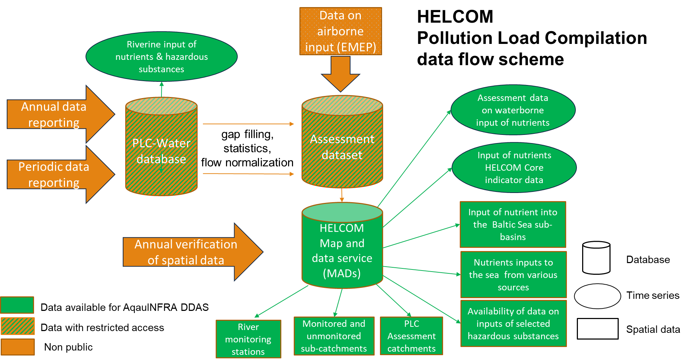
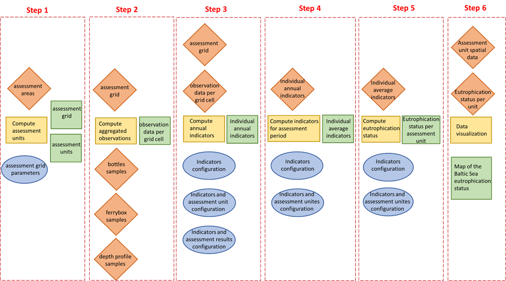
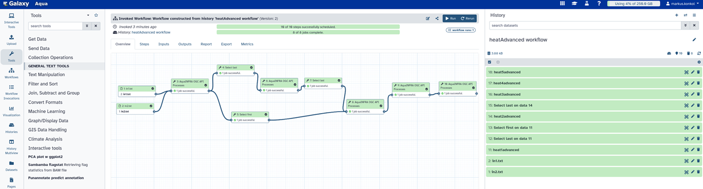
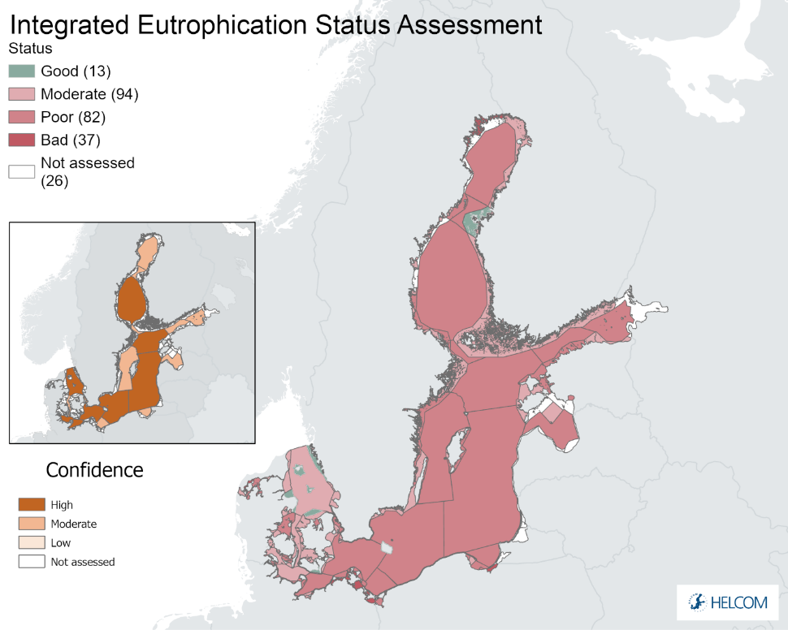

# Workflow

Chapter 3 of 3

    
A breakdown of the analytical pipelines and data integration steps used to assess the effectiveness of measures in the Baltic Sea.

The workflow focuses on standardizing diverse environmental and anthropogenic datasets to create a unified view of the Baltic Sea's health.

### Workflow Stages

1. **Pollution Load Compilation (PLC):** 
   - Automates the ingestion of nutrient emission data.
   - Calculates riverine and direct point-source nutrient loads entering the Baltic Sea.
   - Generates load trends to assess if targets set by the Baltic Sea Action Plan (BSAP) are being met.

2. **DAPSIM Integration:**
   - Connects spatial data representing **Activities** (e.g., shipping, agriculture) with calculated **Pressures** (nutrient loads).
   - Links these pressures to the observed **State** (water quality metrics).
   - Evaluates the **Impacts** on biodiversity and cross-references them against implemented **Measures** (policy changes).

3. **Data Harmonisation & Visualisation:**
   - Harmonises qualitative datasets, ensuring descriptive measures can be mapped spatially.
   - Exports the combined DAPSIM results as interactive dashboards and maps, allowing policy-makers to pinpoint regional successes and failures.

> [!TIP]
> This workflow acts as a reproducible template that can be run periodically to generate the official HELCOM thematic assessments.

### Data Flows & Implementation

The implementation process relies on established data flows and systematic workflows. The HELCOM Pollution Load Compilation (PLC) forms the foundation of this process.

    <figure style="text-align: center; margin: 0;">
      
      <figcaption style="font-size: 0.85rem; color: var(--text-muted); margin-top: 0.5rem;">Figure 1: Generalized data flows in the HELCOM pollution load compilation process.</figcaption>
    </figure>

To assess the eutrophication state, the **HEAT** (HELCOM Eutrophication Assessment Tool) workflow has been modeled and published in the AquaINFRA Galaxy platform.

    <figure style="flex: 1; min-width: 300px; text-align: center; margin: 0;">
      
      <figcaption style="font-size: 0.85rem; color: var(--text-muted); margin-top: 0.5rem;">Figure 2a: Conceptual HELCOM eutrophication assessment tool workflow.</figcaption>
    </figure>
    <figure style="flex: 1; min-width: 300px; text-align: center; margin: 0;">
      
      <figcaption style="font-size: 0.85rem; color: var(--text-muted); margin-top: 0.5rem;">Figure 2b: Tool workflow implemented in the Galaxy platform.</figcaption>
    </figure>

    <figure style="text-align: center; margin: 0;">
      
      <figcaption style="font-size: 0.85rem; color: var(--text-muted); margin-top: 0.5rem;">Figure 3: Visualization of final outputs of the eutrophication assessment tool applied for the Baltic Sea.</figcaption>
    </figure>

---
