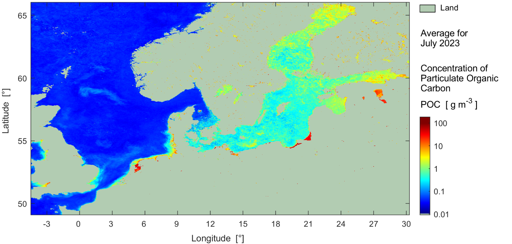

# Introduction

Chapter 1 of 3

    
A satellite perspective on the North Sea and Baltic Sea, merging remote-sensing reflectance with in-situ measurements to classify optical water types.

The North Sea and Baltic Sea represent a highly complex optical environment. Traditional water quality monitoring relies heavily on in-situ sampling, which provides excellent accuracy but suffers from limited spatial and temporal coverage. 

To overcome this, the HEREON use case leverages Earth Observation (EO) data to assess water quality on a macro scale. By combining satellite imagery with local marine observations, we can continuously monitor remote-sensing reflectance and categorise the sea into distinct **Optical Water Types (OWTs)**.

<figure class="diagram diagram--svg">

<svg viewBox="0 0 800 370" role="img" aria-labelledby="her-title her-desc">
  <title id="her-title">Optical Water Type classification from satellite and in-situ observation</title>
  <desc id="her-desc">A Sentinel-3 ocean colour sensor observes three areas of sea surface. Each area is classified as a different Optical Water Type: clear water, turbid or algae-rich water, and CDOM-rich water. An in-situ buoy in the central area provides the validation measurement.</desc>

  <defs>
    <linearGradient id="herOcean" x1="0" y1="0" x2="0" y2="1">
      <stop offset="0%" stop-color="#0284c7"/>
      <stop offset="55%" stop-color="#0369a1"/>
      <stop offset="100%" stop-color="#075985"/>
    </linearGradient>
    <linearGradient id="herBeam1" x1="0" y1="0" x2="0" y2="1">
      <stop offset="0%" stop-color="#38bdf8" stop-opacity="0.55"/>
      <stop offset="100%" stop-color="#38bdf8" stop-opacity="0"/>
    </linearGradient>
    <linearGradient id="herBeam2" x1="0" y1="0" x2="0" y2="1">
      <stop offset="0%" stop-color="#a3e635" stop-opacity="0.55"/>
      <stop offset="100%" stop-color="#a3e635" stop-opacity="0"/>
    </linearGradient>
    <linearGradient id="herBeam3" x1="0" y1="0" x2="0" y2="1">
      <stop offset="0%" stop-color="#fcd34d" stop-opacity="0.55"/>
      <stop offset="100%" stop-color="#fcd34d" stop-opacity="0"/>
    </linearGradient>
  </defs>

  <text x="400" y="34" class="fig-title" text-anchor="middle">Satellite reflectance, validated at sea</text>

  <!-- Sea surface -->
  <path d="M 0 258 Q 200 238 400 258 T 800 258 L 800 370 L 0 370 Z" fill="url(#herOcean)"/>

  <!-- Sensor swaths -->
  <polygon points="400,124 140,278 260,278" fill="url(#herBeam1)"/>
  <polygon points="400,124 320,292 480,292" fill="url(#herBeam2)"/>
  <polygon points="400,124 530,272 670,272" fill="url(#herBeam3)"/>

  <!-- Optical water type zones -->
  <ellipse cx="200" cy="278" rx="62" ry="15" fill="#38bdf8" opacity="0.45"/>
  <ellipse cx="400" cy="292" rx="82" ry="19" fill="#a3e635" opacity="0.45"/>
  <ellipse cx="600" cy="272" rx="70" ry="15" fill="#fcd34d" opacity="0.45"/>

  <!-- Sentinel-3 -->
  <g transform="translate(400, 96)">
    <rect x="-25" y="-15" width="50" height="30" rx="5" fill="#e2e8f0"/>
    <rect x="-15" y="-10" width="30" height="20" fill="#94a3b8"/>
    <rect x="-85" y="-5" width="60" height="10" fill="#3b82f6" stroke="#1e3a8a" stroke-width="1"/>
    <rect x="25" y="-5" width="60" height="10" fill="#3b82f6" stroke="#1e3a8a" stroke-width="1"/>
    <polygon points="-5,15 5,15 10,26 -10,26" fill="#64748b"/>
    <text x="0" y="-26" class="fig-label" text-anchor="middle">Sentinel-3 ocean colour</text>
  </g>

  <!-- In-situ validation buoy -->
  <g transform="translate(400, 248)">
    <rect x="-5" y="-30" width="10" height="30" fill="#facc15"/>
    <circle cx="0" cy="0" r="12" fill="#ef4444"/>
    <path d="M-15 0 Q 0 10 15 0 Z" fill="#b91c1c"/>
    <line x1="0" y1="-30" x2="0" y2="-52" stroke="#cbd5e1" stroke-width="2"/>
    <circle cx="0" cy="-52" r="3" fill="#cbd5e1"/>
    <path d="M 11 -42 A 11 11 0 0 1 17 -53" fill="none" stroke="#38bdf8" stroke-width="2"/>
    <path d="M 17 -37 A 17 17 0 0 1 25 -58" fill="none" stroke="#38bdf8" stroke-width="2"/>
    <text x="34" y="-44" class="fig-label fig-accent-sky">In-situ validation</text>
  </g>

  <!-- Classified water types -->
  <text x="200" y="336" class="fig-label fig-accent-sky" text-anchor="middle">OWT 1: clear</text>
  <text x="356" y="352" class="fig-label fig-accent-lime" text-anchor="middle">OWT 2: turbid / algae</text>
  <text x="648" y="330" class="fig-label fig-accent-amber" text-anchor="middle">OWT 3: CDOM-rich</text>
</svg>

<figcaption>Figure 2: Earth Observation satellites capture multi-spectral reflectance, classifying the sea into distinct Optical Water Types, validated by in-situ buoys.</figcaption>
</figure>

    <figure style="text-align: center; margin: 0;">
      
      <figcaption style="font-size: 0.85rem; color: var(--text-muted); margin-top: 0.5rem;">Figure 1: Estimate of the concentration of particulate organic carbon (POC) in the upper water column averaged for July 2023 within the North Sea-Baltic Sea region.</figcaption>
    </figure>

### System Characteristics

    <table>
        <thead>
            <tr>
                <th>Component</th>
                <th>Description</th>
            </tr>
        </thead>
        <tbody>
            <tr>
                <td><strong>Primary Data Source</strong></td>
                <td>Satellite remote-sensing reflectance (e.g., from Sentinel-3 OLCI) providing wide-scale, high-frequency spectral data.</td>
            </tr>
            <tr>
                <td><strong>In-situ Integration</strong></td>
                <td>Data from buoys, research vessels, and FerryBox systems are used as "ground truth" to validate and calibrate the satellite imagery.</td>
            </tr>
            <tr>
                <td><strong>Optical Water Types (OWTs)</strong></td>
                <td>A classification system that categorizes water based on its optical properties (e.g., clear, turbid, algae-dominated, CDOM-rich).</td>
            </tr>
            <tr>
                <td><strong>Target Regions</strong></td>
                <td>The North Sea and Baltic Sea—highly dynamic regions where coastal run-off and algal blooms rapidly change water properties.</td>
            </tr>
        </tbody>
    </table>

---
