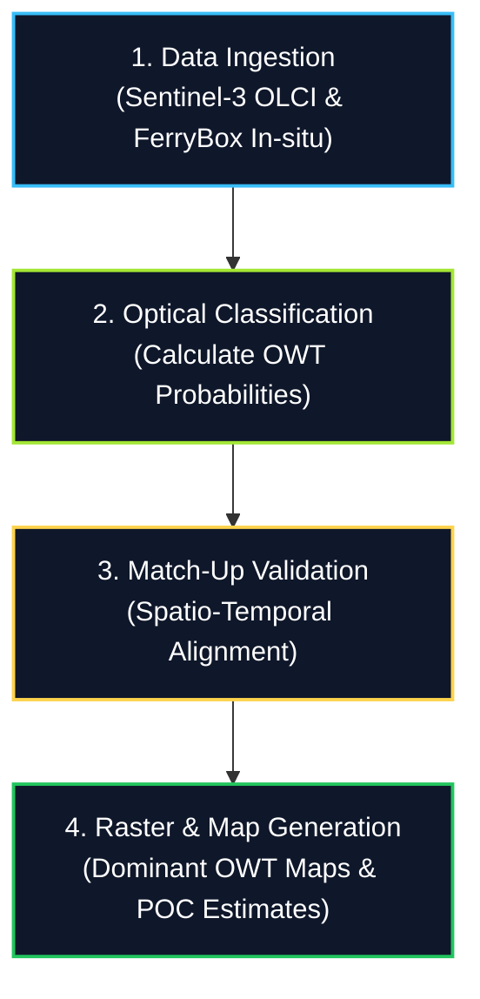
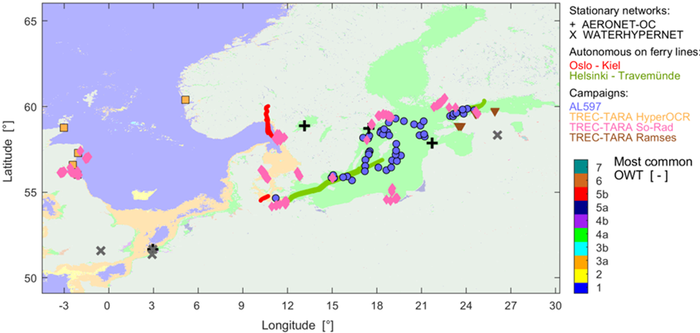
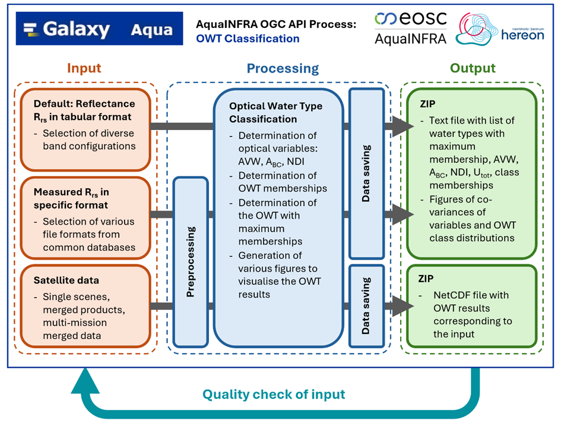

# Workflow

Chapter 3 of 3

    
A step-by-step breakdown of how satellite and in-situ data are integrated to classify Optical Water Types.

### Processing Stages

The analytical pipeline is broken down into four core steps:

1. **Data Ingestion:**
   - Retrieve satellite Level-2 products (remote-sensing reflectance) for the North Sea and Baltic Sea.
   - Import corresponding in-situ observation datasets containing physical water samples.

2. **Optical Classification:**
   - Apply specialized algorithms to the satellite reflectance data to calculate the probability of each pixel belonging to predefined **Optical Water Types (OWTs)**.
   - Mask out clouds, land, and invalid pixels.

3. **Match-Up Analysis (Validation):**
   - Spatially and temporally align ("match-up") the satellite-derived classifications with the in-situ measurements.
   - Evaluate the algorithm's performance, checking if the satellite accurately predicted the true optical state of the water at the exact location and time the physical sample was taken.

4. **Result Generation:**
   - Output statistical validation reports.
   - Generate raster maps displaying the dominant Optical Water Type across the entire sea region for selected time periods.

    <figure style="text-align: center; margin: 0;">
      
      <figcaption style="font-size: 0.85rem; color: var(--text-muted); margin-top: 0.5rem;">Figure 2: Merging of satellite data with in-situ measurements of remote-sensing reflectance.</figcaption>
    </figure>

    <figure style="text-align: center; margin: 0;">
      
      <figcaption style="font-size: 0.85rem; color: var(--text-muted); margin-top: 0.5rem;">Figure 3: Workflow for Optical Water Type classification from diverse sources in the Galaxy environment.</figcaption>
    </figure>

    
Check Your Understanding: Optical Water Type Validation

    

        
<strong>Question:</strong> Why is spatio-temporal match-up analysis essential when combining Sentinel-3 satellite imagery with FerryBox in-situ measurements?

        
<strong>Answer:</strong> Coastal water optical properties change rapidly due to tides, wind mixing, and algal blooms. Aligning satellite pixels with ground-truth FerryBox readings in exact space and time ensures that atmospheric correction errors and optical classification uncertainties are accurately calibrated.

    

---
