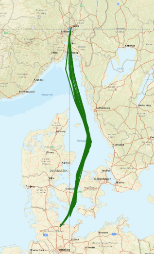

# Introduction

Chapter 1 of 3

    
Investigating the impact of extreme weather events on coastal marine environments by combining river fluxes with FerryBox data in the Oslofjord.

The Oslofjord, a major inlet in the south-east of Norway, receives significant freshwater input from the Glomma River—Norway's longest and most voluminous river. The interaction between this massive freshwater discharge and the saline fjord environment creates a highly dynamic coastal ecosystem.

As climate change alters weather patterns, extreme events such as intense storms and flash floods are becoming more frequent. This use case focuses on tracking how these extreme events mobilize land-based materials (like suspended sediments and dissolved organic matter) and transport them into the Oslofjord.

<figure class="diagram diagram--svg">

<svg viewBox="0 0 800 360" role="img" aria-labelledby="osl-title osl-desc">
  <title id="osl-title">Storm-driven transport from the Glomma River into the Oslofjord</title>
  <desc id="osl-desc">An extreme storm over the catchment raises Glomma discharge. River sensors record the flux, the turbid freshwater plume spreads into the fjord, and FerryBox transects sample the plume along the vessel track.</desc>

  <defs>
    <linearGradient id="oslRiver" x1="0" y1="0" x2="1" y2="1">
      <stop offset="0%" stop-color="#38bdf8"/>
      <stop offset="100%" stop-color="#1d4ed8"/>
    </linearGradient>
    <linearGradient id="oslSea" x1="0" y1="0" x2="0" y2="1">
      <stop offset="0%" stop-color="#075985"/>
      <stop offset="100%" stop-color="#0c4a6e"/>
    </linearGradient>
    <linearGradient id="oslStorm" x1="0" y1="0" x2="0" y2="1">
      <stop offset="0%" stop-color="#64748b"/>
      <stop offset="100%" stop-color="#334155"/>
    </linearGradient>
  </defs>

  <text x="400" y="36" class="fig-title" text-anchor="middle">Tracking a storm event into the fjord</text>

  <!-- Fjord -->
  <rect x="0" y="222" width="800" height="138" fill="url(#oslSea)"/>

  <!-- Catchment and the Glomma -->
  <path d="M 0 150 Q 160 150 290 222 L 0 222 Z" fill="#334155"/>
  <path d="M 0 182 Q 130 182 250 222 L 0 222 Z" fill="url(#oslRiver)"/>

  <!-- Storm system -->
  <g transform="translate(126, 128)">
    <path d="M0,38 Q-22,38 -22,19 Q-22,0 0,0 Q10,-28 40,-28 Q70,-28 78,0 Q106,-9 116,10 Q126,38 98,38 Z" fill="url(#oslStorm)"/>
    <path d="M 44,40 L 34,58 L 52,58 L 38,80" fill="none" stroke="#fbbf24" stroke-width="4" stroke-linejoin="round"/>
    <text x="48" y="-20" class="fig-label" text-anchor="middle">Extreme storm event</text>
  </g>

  <g transform="translate(78, 202)">
    <circle cx="0" cy="0" r="11" fill="#10b981" stroke="#0f172a" stroke-width="3"/>
    <text x="26" y="40" class="fig-label" text-anchor="middle">River sensors</text>
    <text x="26" y="60" class="fig-sub" text-anchor="middle">Glomma discharge</text>
  </g>

  <!-- Freshwater plume -->
  <path d="M 250 222 Q 400 226 510 306 Q 336 300 276 222 Z" fill="#0ea5e9" opacity="0.75"/>
  <path d="M 250 222 Q 350 244 440 276 Q 320 272 278 222 Z" fill="#a8a29e" opacity="0.5"/>
  <text x="372" y="338" class="fig-label" text-anchor="middle">Turbid freshwater plume</text>

  <!-- FerryBox vessel -->
  <g transform="translate(596, 196)">
    <path d="M-42,24 L52,24 L68,0 L-52,0 Z" fill="#e2e8f0"/>
    <path d="M-42,24 L52,24 L46,34 L-36,34 Z" fill="#ef4444"/>
    <rect x="-20" y="-16" width="40" height="16" fill="#94a3b8"/>
    <line x1="0" y1="34" x2="0" y2="84" stroke="#facc15" stroke-width="3" stroke-dasharray="5 3"/>
    <circle cx="0" cy="84" r="6" fill="#facc15"/>
    <text x="0" y="-30" class="fig-label" text-anchor="middle">FerryBox transect</text>
    <text x="0" y="126" class="fig-sub" text-anchor="middle">Continuous marine sampling</text>
  </g>

  <!-- Flux pathway -->
  <path d="M 150 250 Q 320 294 470 294" fill="none" stroke="#e2e8f0" stroke-width="2.5" stroke-dasharray="7 6" opacity="0.75"/>
  <polygon points="470,288 484,294 470,300" fill="#e2e8f0" opacity="0.75"/>
  <text x="296" y="268" class="fig-sub" text-anchor="middle">Sediment and nutrient flux</text>
</svg>

<figcaption>Figure 2: Tracing the impact of extreme storm events from the Glomma River out into the Oslofjord using FerryBox transects.</figcaption>
</figure>

    <figure style="text-align: center; margin: 0;">
      

        
        
        
      

      <figcaption style="font-size: 0.85rem; color: var(--text-muted); margin-top: 1rem;">Figure 1: Overview of the Oslofjord region, showing the Glomma River landscape, the catchment area, and the marine monitoring stations alongside the FerryBox route between Kiel and Oslo.</figcaption>
    </figure>

### System Characteristics

    <table>
        <thead>
            <tr>
                <th>Component</th>
                <th>Description</th>
            </tr>
        </thead>
        <tbody>
            <tr>
                <td><strong>Riverine Input</strong></td>
                <td>The Glomma River provides the largest freshwater discharge in Norway, carrying nutrients, sediments, and organic matter into the coastal zone.</td>
            </tr>
            <tr>
                <td><strong>Marine Recipient</strong></td>
                <td>The Oslofjord, a deep coastal inlet subject to intense anthropogenic pressures and shifting climate dynamics.</td>
            </tr>
            <tr>
                <td><strong>Extreme Events</strong></td>
                <td>Focuses on rapid, high-volume freshwater discharges caused by intense storms, flash floods, or rapid snowmelts.</td>
            </tr>
            <tr>
                <td><strong>Observation Network</strong></td>
                <td>Combines inland hydrological stations (river fluxes) with coastal FerryBox systems installed on passenger ferries crossing the fjord.</td>
            </tr>
        </tbody>
    </table>

---
