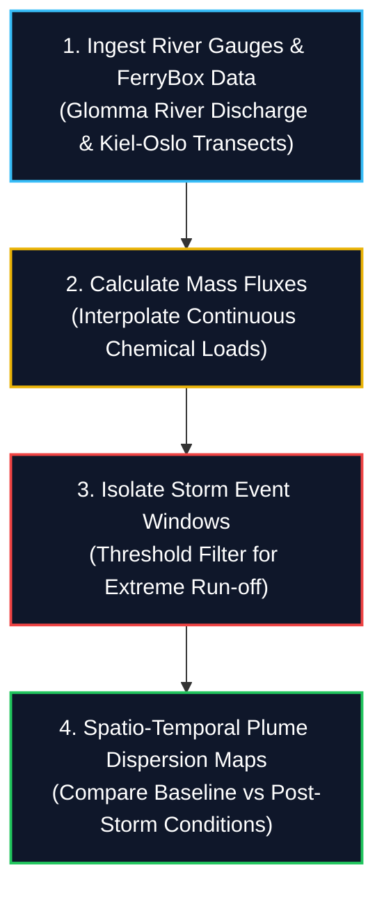
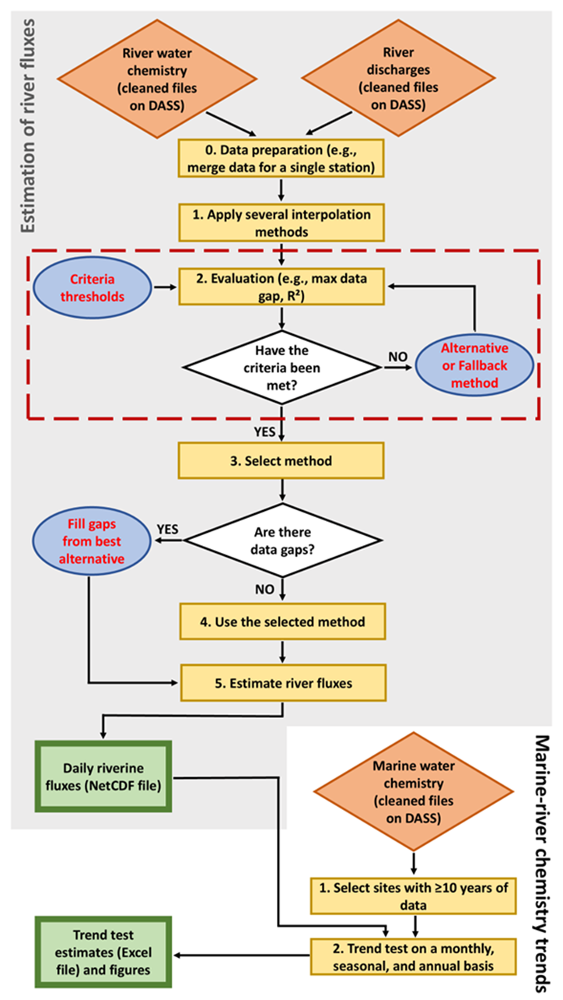
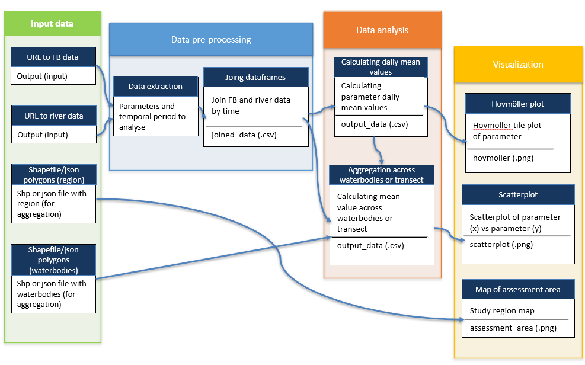

# Workflow

Chapter 3 of 3

    
A sequential breakdown of how river fluxes and FerryBox marine data are integrated for extreme event analysis.

### Processing Stages

1. **Calculate River Fluxes:**
   - Ingest daily water discharge data from the Glomma River alongside discrete water quality sampling data.
   - Interpolate missing data points and calculate the continuous mass flux (load) of specific materials (e.g., nitrogen, phosphorus, suspended particulate matter) entering the fjord.

2. **Isolate Extreme Events:**
   - Apply statistical thresholds to the river discharge data to identify and isolate specific time windows representing "extreme events" (e.g., storms, flash floods).

3. **FerryBox Marine Matching:**
   - Ingest FerryBox transect data from commercial vessels crossing the Oslofjord.
   - Filter the FerryBox dataset temporally to match the isolated "extreme event" windows (and their immediate aftermath).

4. **Spatial-Temporal Analysis:**
   - Perform trend analyses comparing baseline marine conditions to the post-storm marine conditions.
   - Generate spatial maps showing the extent of the freshwater plume and the dispersion of river-transported materials throughout the coastal zone.

    <figure style="text-align: center; margin: 0;">
      
      <figcaption style="font-size: 0.85rem; color: var(--text-muted); margin-top: 0.5rem;">Figure 2: Schematic workflow for calculating river fluxes and Marine-river chemistry trends based on either river fluxes or marine data.</figcaption>
    </figure>

    <figure style="text-align: center; margin: 0;">
      
      <figcaption style="font-size: 0.85rem; color: var(--text-muted); margin-top: 0.5rem;">Figure 3: Global workflow of FerryBox and River sensors in the Oslofjord for analyses of spatial and temporal variation before, during, and after a storm event.</figcaption>
    </figure>

    
Check Your Understanding: FerryBox &amp; River Matching

    

        
<strong>Question:</strong> Why is FerryBox monitoring uniquely suited for evaluating land-sea interactions after extreme storm events in the Oslofjord?

        
<strong>Answer:</strong> FerryBox systems installed on commercial ferries travel fixed, high-frequency transects across the Oslofjord daily. This provides continuous spatial and temporal surface water quality data before, during, and after flash floods, capturing short-lived river plume dispersion that static monitoring stations might miss.

    

---
