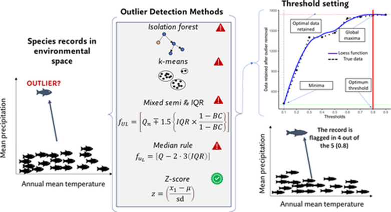

# Specleaner Documentation & Data Harmonization

Chapter 3 of 6

    
Any single outlier-detection method has a blind spot. <a href="../../reference/glossary#specleanr">Specleaner</a> (the <code>specleanr</code> R package) runs around 20 methods - univariate and multivariate - and votes, classifying each record from "not an outlier" through to "perfect outlier". This chapter explains the ensemble idea and how you choose a removal threshold for your model.

    <iframe src="https://www.youtube.com/embed/MxSsaN1HvXY" title="YouTube video player" frameborder="0" allow="accelerometer; autoplay; clipboard-write; encrypted-media; gyroscope; picture-in-picture; web-share" referrerpolicy="strict-origin-when-cross-origin" allowfullscreen></iframe>

## How specleanr works

    <figure style="text-align: center; margin: 0;">
      
      <figcaption style="font-size: 0.85rem; color: var(--text-muted); margin-top: 0.5rem;">Figure 1: The principle of ensemble outlier detection and removal of species records obtained from open-access data repositories (Basooma et al. 2025).</figcaption>
    </figure>

    
Check Your Understanding: Ensemble Voting Thresholds

    

        
<strong>Question:</strong> Why does Specleaner use an ensemble voting threshold instead of relying on a single outlier detection algorithm?

        
<strong>Answer:</strong> Single algorithms (like Mahalanobis distance or Isolation Forests alone) have specific assumptions and blind spots. An ensemble approach runs ~20 univariate and multivariate methods in parallel and aggregates votes, preventing valid ecological extremes from being falsely flagged as errors while effectively removing sampling artefacts.

    

---
