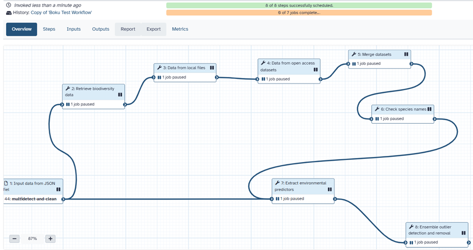

# Pan-European D2K Packages

Chapter 4 of 6

    
The Specleaner <a href="../../reference/glossary#d2kp">Data-to-Knowledge Package</a> gathers the workflow, a Binder virtual lab, OGC web-API endpoints, the reproducible toolbox, and the demo datasets - all citable on Zenodo. This chapter shows how to find it on the AIP and set up the run in Aqua Galaxy. You need to be signed in to your <a href="../../reference/prerequisites">Aqua Galaxy account</a> for the import to save.

    <iframe src="https://www.youtube.com/embed/JmiQu58eDis" title="YouTube video player" frameborder="0" allow="accelerometer; autoplay; clipboard-write; encrypted-media; gyroscope; picture-in-picture; web-share" referrerpolicy="strict-origin-when-cross-origin" allowfullscreen></iframe>

## How a D2KP fits together

    

## Workflow overview

    <figure style="text-align: center; margin: 0;">
      
      <figcaption style="font-size: 0.85rem; color: var(--text-muted); margin-top: 0.5rem;">Figure 2: Workflow in the Galaxy Platform detailing the acquisition and merging of multiple data sources, the extraction of environmental predictors, and ensemble outlier detection and removal.</figcaption>
    </figure>

    
Check Your Understanding: D2KP Architecture

    

        
<strong>Question:</strong> What are the 4 interaction levels provided by an AquaINFRA Data-to-Knowledge Package (D2KP)?

        
<strong>Answer:</strong> 
        1. <em>Data & Code</em> (Raw CSV/NetCDF files + R/Python source scripts) 
        2. <em>Aqua Galaxy Workflow</em> (No-code pipeline execution via <code>.ga</code> files) 
        3. <em>Web API</em> (Direct pygeoapi endpoint access for software integration) 
        4. <em>MyBinder Virtual Lab</em> (Live interactive RStudio/Jupyter container environment)
        

    

---
