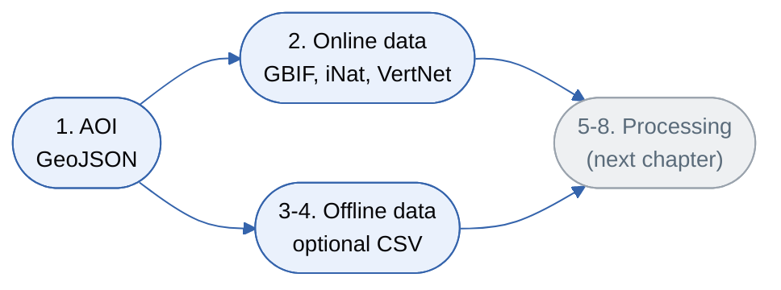

# Functional Traits (fwtraits) Analysis

Chapter 5 of 6

    
The first half of the eight-step pipeline: defining the study area from a GeoJSON polygon, then pulling occurrence records from GBIF, iNaturalist, and VertNet. Steps 3 and 4 are optional - they let you mix in your own local data.

    <iframe src="https://www.youtube.com/embed/vdoHCh_vr0M" title="YouTube video player" frameborder="0" allow="accelerometer; autoplay; clipboard-write; encrypted-media; gyroscope; picture-in-picture; web-share" referrerpolicy="strict-origin-when-cross-origin" allowfullscreen></iframe>

## Workflow: steps 1-4

---
