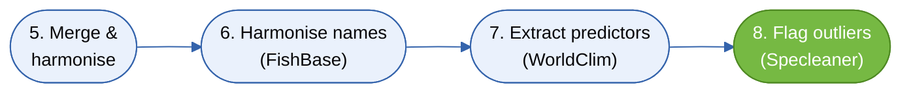

# Conclusion & Synthesis Sequence

Chapter 6 of 6

    
The second half of the pipeline: merging the sources, resolving synonyms against FishBase, extracting predictors, and flagging outliers with Specleaner. Finally, preview the workflow output and download the final classified CSV. The workflow is geography-agnostic, serves coders and non-coders alike, and is FAIR and citable via its <a href="https://aquainfra.dev.52north.org/result/zenodo:17175591" target="_blank" rel="noopener">Zenodo DOI</a>.

    <iframe src="https://www.youtube.com/embed/RQZmhttOu5Y" title="YouTube video player" frameborder="0" allow="accelerometer; autoplay; clipboard-write; encrypted-media; gyroscope; picture-in-picture; web-share" referrerpolicy="strict-origin-when-cross-origin" allowfullscreen></iframe>

## Workflow: steps 5-8

## What's next

Endangered species like the Danube sturgeon and Huchen depend on clean, defensible data: cleaner occurrences mean better species distribution models and better-targeted protection. The same workflow runs anywhere - just swap the GeoJSON area of interest.

- Browse the other [Applied Use Case Trainings]({{ relative_root }}06_use_cases).
- Refresh terms in the [Glossary]({{ relative_root }}reference/glossary).
- Reach the team via the [Contact page]({{ relative_root }}07_contact).

---
