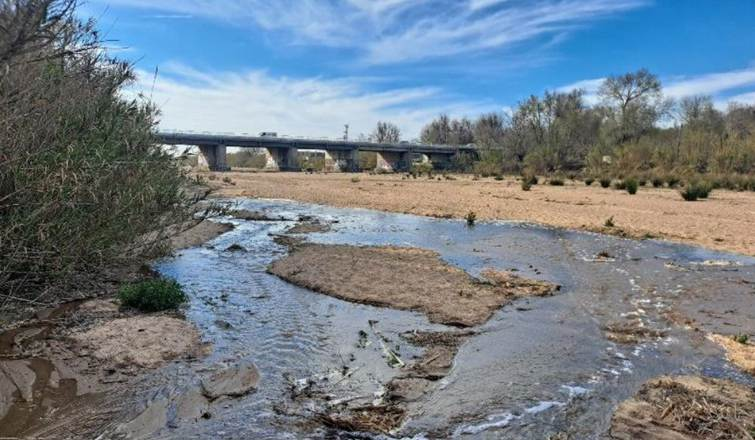
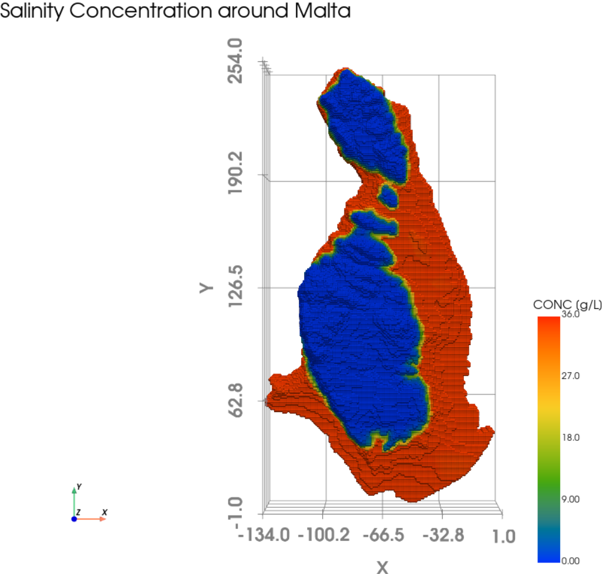
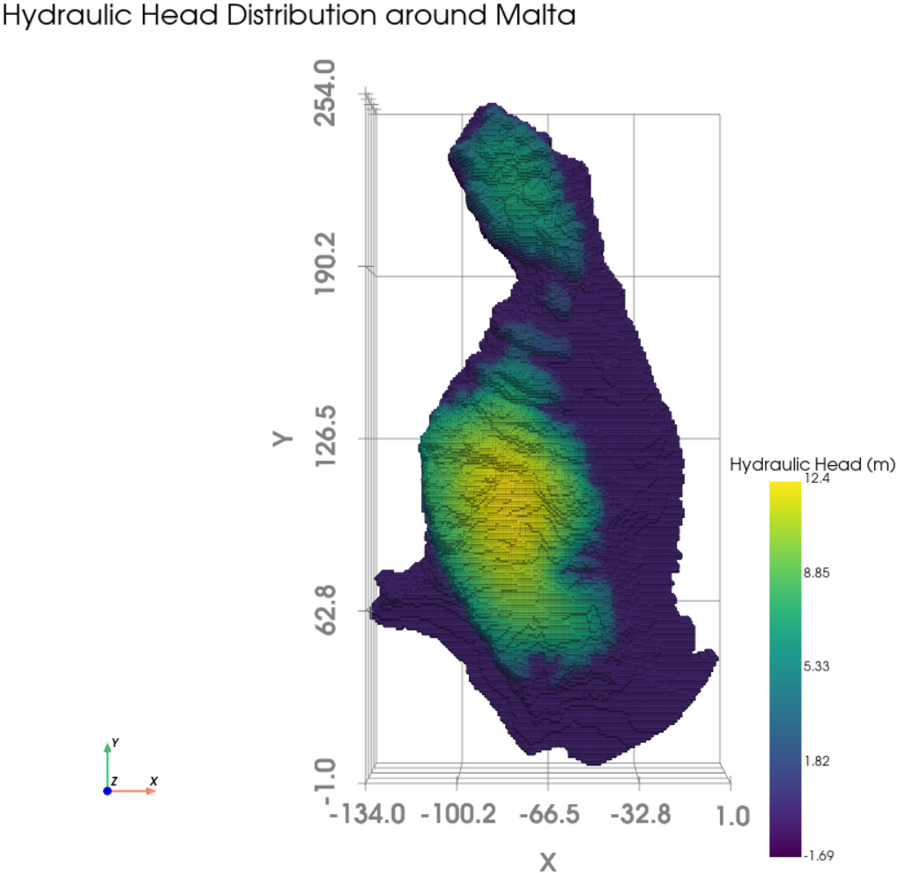

# Introduction

Chapter 1 of 3

    
Exploring the effects of climate change on Mediterranean coastal systems through two distinct lenses: extreme river flooding (Tordera) and subterranean groundwater discharge (Malta).

The Mediterranean region is highly vulnerable to the impacts of climate change, particularly regarding water quantity and quality. This use case demonstrates the reusability of the AquaINFRA modelling infrastructure across fundamentally different hydrological environments within the same climate zone.

We explore this through two parallel case studies:

1. **The Tordera River (Spain):** Focusing on surface-level extreme events, specifically how flash floods transport vast quantities of sediment and nutrients into the sea.
2. **The Maltese Islands (Malta):** Focusing on the hidden subterranean connection, specifically submarine groundwater discharge (SGD) and the threat of saltwater intrusion into fragile coastal aquifers.

<figure class="diagram diagram--svg diagram--svg--w860">

<svg viewBox="0 0 860 420" role="img" aria-labelledby="tor-title tor-desc">
  <title id="tor-title">Two land-sea pathways: Tordera flash floods and Maltese groundwater discharge</title>
  <desc id="tor-desc">Left panel: the Tordera catchment in Spain, where flash floods move sediment and nutrients over the surface into the sea in short pulses. Right panel: a cross-section of the Maltese carbonate aquifer, where fresh groundwater discharges to the sea underground while saltwater intrudes inland beneath it.</desc>

  <defs>
    <linearGradient id="torRiver" x1="0" y1="0" x2="0" y2="1">
      <stop offset="0%" stop-color="#60a5fa"/>
      <stop offset="100%" stop-color="#1d4ed8"/>
    </linearGradient>
    <linearGradient id="torSea" x1="0" y1="0" x2="0" y2="1">
      <stop offset="0%" stop-color="#0284c7"/>
      <stop offset="100%" stop-color="#0c4a6e"/>
    </linearGradient>
    <pattern id="torAquifer" patternUnits="userSpaceOnUse" width="22" height="22">
      <rect width="22" height="22" fill="#292524"/>
      <circle cx="11" cy="11" r="2.2" fill="#78716c"/>
      <path d="M0,11 L22,11 M11,0 L11,22" stroke="#44403c" stroke-width="0.8"/>
    </pattern>
    <marker id="torArrowSky" viewBox="0 0 10 10" refX="8" refY="5" markerWidth="5" markerHeight="5" orient="auto-start-reverse">
      <path d="M 0 0 L 10 5 L 0 10 z" fill="#38bdf8"/>
    </marker>
    <marker id="torArrowRose" viewBox="0 0 10 10" refX="8" refY="5" markerWidth="5" markerHeight="5" orient="auto-start-reverse">
      <path d="M 0 0 L 10 5 L 0 10 z" fill="#f87171"/>
    </marker>
  </defs>

  <!-- Panel divider -->
  <line x1="430" y1="60" x2="430" y2="396" stroke="#334155" stroke-width="2" stroke-dasharray="8 8"/>

  <!-- LEFT: Tordera, surface pathway -->
  <g>
    <text x="215" y="40" class="fig-title" text-anchor="middle">Tordera River, Spain</text>
    <text x="215" y="64" class="fig-sub" text-anchor="middle">Surface pathway: flash floods</text>

    <path d="M 20 228 L 108 138 L 190 228 L 262 172 L 400 272 L 20 272 Z" fill="#475569"/>
    <path d="M 20 272 Q 210 272 400 356 L 20 356 Z" fill="#334155"/>
    <path d="M 20 356 L 400 356 L 400 396 L 20 396 Z" fill="url(#torSea)"/>

    <path d="M 108 138 Q 158 224 262 244 T 400 320 L 400 348 Q 262 272 158 244 T 108 150 Z" fill="url(#torRiver)"/>
    <path d="M 392 352 Q 330 372 392 396" fill="none" stroke="#38bdf8" stroke-width="18" stroke-linecap="round" opacity="0.5"/>

    <g transform="translate(268, 222)">
      <circle cx="0" cy="0" r="13" fill="#ef4444" stroke="#0f172a" stroke-width="3"/>
      <text x="0" y="-22" class="fig-label fig-accent-rose" text-anchor="middle">Flash flood</text>
    </g>
    <text x="215" y="386" class="fig-sub" text-anchor="middle">Sediment and nutrient pulse</text>
  </g>

  <!-- RIGHT: Malta, subterranean pathway -->
  <g transform="translate(430, 0)">
    <text x="215" y="40" class="fig-title" text-anchor="middle">Maltese Islands</text>
    <text x="215" y="64" class="fig-sub" text-anchor="middle">Hidden pathway: groundwater</text>

    <!-- Carbonate rock body, island and seabed -->
    <path d="M 30 214 L 190 214 Q 240 214 262 252 L 400 316 L 400 396 L 30 396 Z" fill="url(#torAquifer)"/>

    <!-- Coastal sea filling the space above the seabed -->
    <path d="M 262 252 L 400 316 L 400 232 L 262 232 Z" fill="url(#torSea)"/>
    <path d="M 262 232 L 400 232" stroke="#7dd3fc" stroke-width="2" opacity="0.7"/>
    <path d="M 30 214 L 190 214 Q 240 214 262 252 L 262 272 Q 236 232 190 232 L 30 232 Z" fill="#16a34a" opacity="0.4"/>

    <!-- Fresh groundwater moving seaward -->
    <path d="M 66 300 Q 150 300 236 326" fill="none" stroke="#38bdf8" stroke-width="4" marker-end="url(#torArrowSky)"/>
    <text x="152" y="286" class="fig-label fig-accent-sky" text-anchor="middle">Fresh groundwater</text>

    <!-- Saltwater wedge pushing inland -->
    <path d="M 372 350 Q 250 366 176 348" fill="none" stroke="#f87171" stroke-width="4" marker-end="url(#torArrowRose)"/>
    <text x="228" y="390" class="fig-label fig-accent-rose" text-anchor="middle">Saltwater intrusion</text>

    <text x="120" y="256" class="fig-note" text-anchor="middle">Permeable carbonate rock</text>
    <text x="336" y="256" class="fig-sub" text-anchor="middle">Coastal sea</text>
  </g>
</svg>

<figcaption>Figure 3: Conceptual comparison of surface extreme events (Tordera, Spain) and subterranean groundwater dynamics (Malta).</figcaption>
</figure>

    <figure style="text-align: center; margin: 0;">
      

        
        
        
      

      <figcaption style="font-size: 0.85rem; color: var(--text-muted); margin-top: 1rem;">Figure 1: Tordera catchment (left) exhibiting high variability in water quantity and quality patterns, contrasting long dry periods (middle) with short flash floods (right).</figcaption>
    </figure>

    <figure style="text-align: center; margin: 0;">
      

        
        
      

      <figcaption style="font-size: 0.85rem; color: var(--text-muted); margin-top: 1rem;">Figure 2: The Maltese archipelago, highlighting the hydrogeological system dominated by permeable carbonate formations and groundwater resources.</figcaption>
    </figure>

### System Characteristics

    <table>
        <thead>
            <tr>
                <th>Region</th>
                <th>Core Challenge</th>
                <th>Description</th>
            </tr>
        </thead>
        <tbody>
            <tr>
                <td><strong>Tordera (Spain)</strong></td>
                <td>Extreme Surface Run-off</td>
                <td>A highly dynamic river system prone to extreme flash floods during intense storms. These events rapidly mobilize massive amounts of sediment and terrestrial nutrients, drastically impacting the coastal marine ecosystem.</td>
            </tr>
            <tr>
                <td><strong>Malta</strong></td>
                <td>Submarine Groundwater Discharge</td>
                <td>An island system entirely dependent on fragile coastal aquifers for freshwater. Over-extraction and rising sea levels threaten these aquifers with <strong>saltwater intrusion</strong>, while subterranean groundwater discharge quietly leaks nutrients into the sea.</td>
            </tr>
        </tbody>
    </table>

---
