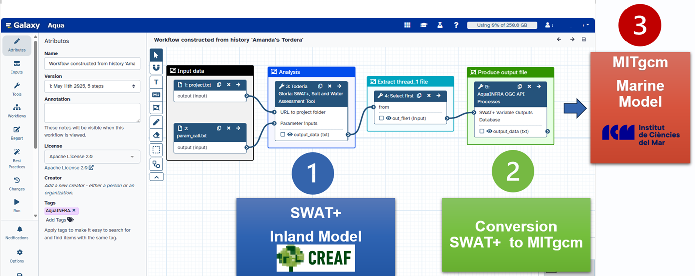
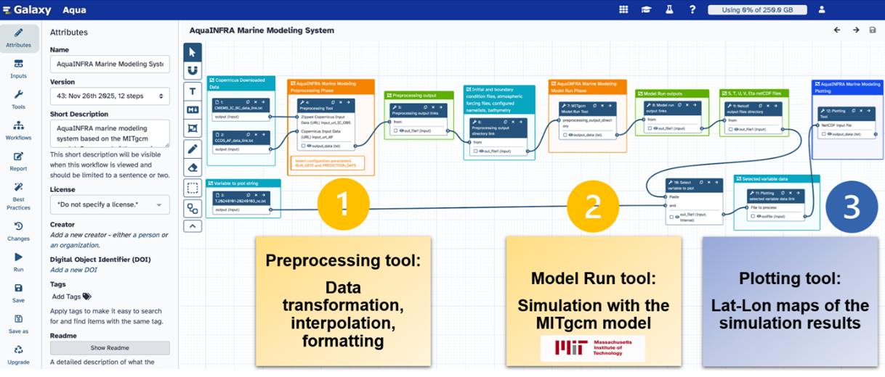
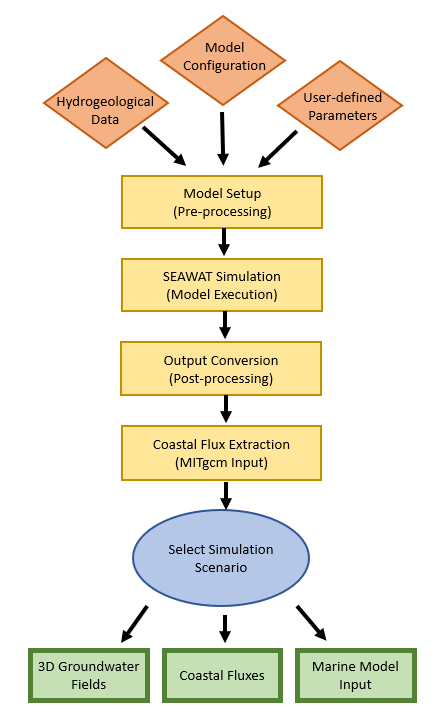
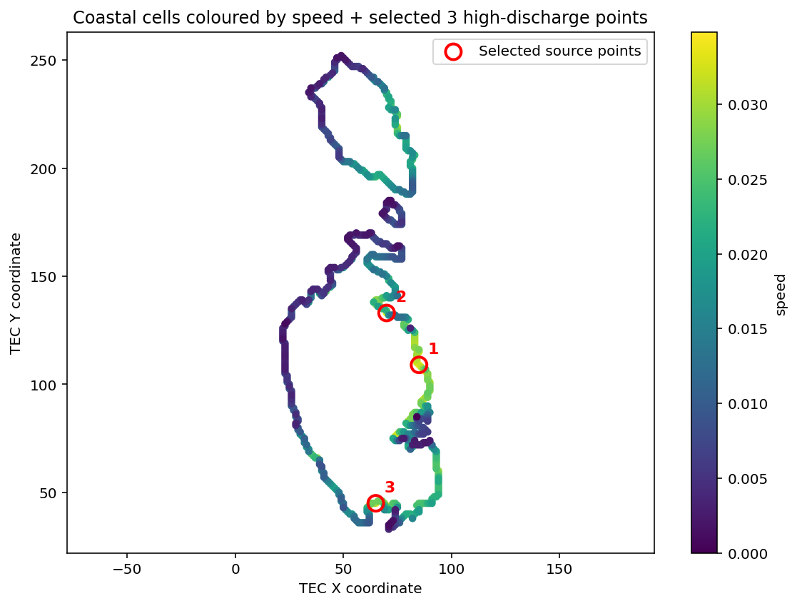

# Workflow

Chapter 3 of 3

    
A breakdown of the coupled modelling approaches used for the two Mediterranean case studies.

Because the Mediterranean case studies address two fundamentally different hydrological problems, the workflow is split into two specialized modelling approaches within the AquaINFRA infrastructure.

### Tordera Workflow: Coupled Inland-Marine Modelling

The Tordera workflow adapts the hydrological models originally built for northern catchments to simulate extreme Mediterranean flash floods.

1. **Inland Catchment Model:** 
   - Utilizes adapted SWAT (Soil and Water Assessment Tool) models to simulate the rapid accumulation and run-off of water during intense rainfall events over the Tordera basin.
2. **Coupled Marine Model:** 
   - The output of the inland model (freshwater, sediment, and nutrient loads) is fed directly into a coastal hydrodynamic model.
   - This simulates how the flood plume disperses into the Mediterranean Sea and impacts coastal water quality.

    <figure style="text-align: center; margin: 0;">
      

        
        
      

      <figcaption style="font-size: 0.85rem; color: var(--text-muted); margin-top: 1rem;">Figure 4: Global workflow of the coupled inland-marine model (left) and detailed workflow of the marine component (right) for the Tordera catchment.</figcaption>
    </figure>

### Malta Workflow: Groundwater Modelling

The Malta workflow shifts the focus entirely underground, utilizing specialized groundwater simulation tools.

1. **Aquifer Simulation (SEAWAT):**
   - Implements a SEAWAT-based groundwater component. SEAWAT is specifically designed to simulate variable-density groundwater flow, making it ideal for tracking the delicate balance between fresh groundwater and dense seawater.
2. **Coastal Interaction:**
   - The model maps the subterranean pathways where fresh water escapes into the sea (Submarine Groundwater Discharge).
   - Simultaneously, it tracks the inland migration of the saltwater wedge (Saltwater Intrusion) under different climate and extraction scenarios.

    <figure style="text-align: center; margin: 0;">
      

        
        
      

      <figcaption style="font-size: 0.85rem; color: var(--text-muted); margin-top: 1rem;">Figure 5: Detailed workflow of the groundwater SEAWAT model (left) and submarine groundwater discharge mapping along the Maltese coastline (right).</figcaption>
    </figure>

> [!NOTE]
> Together, these workflows demonstrate that the AquaINFRA platform is not limited to surface-level riverine transport; its tools can be successfully adapted for both episodic extreme events and subterranean variable-density flow.

---
